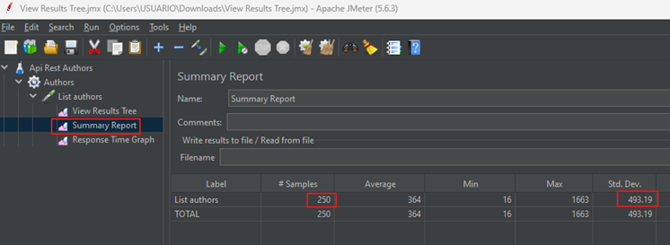

# Pruebas de rendimiento con JMeter

En este proyecto, veremos un conjunto de ejemplos de como realizar pruebas de rendimiento usando `JMeter` sobre nuestra
aplicación desarrollada con `Spring Boot WebFlux`. Aunque también habría podido usar un proyecto
`Spring Boot Web (Servlet)`, pero para variar quise usar un proyecto reactivo.

**Fuente**

- [Load Performance Testing with Apache JMeter - medium](https://medium.com/@truongbui95/load-performance-testing-with-apache-jmeter-e20b41d5a3f2)
- [JMeter tutorial](https://howtodoinjava.com/java/library/jmeter-beginners-tutorial/)

---

## Iniciar aplicación

Esta aplicación desarrollada con `Spring Boot WebFlux` está lista para ser levantada, simplemente debemos seguir estos
pasos:

1. Levantar el contenedor de la base de datos de `postgresql` con el comando `docker compose up -d`.
2. Levantar la aplicación. Cada vez que levantemos la aplicación, la base de datos se va a poblar con los mismos datos.

Para el desarrollo de las pruebas con `JMeter` trabajaremos con los endpoints del controlador `AuthorController`.

---

## [Apache JMeter](https://jmeter.apache.org/index.html)

La aplicación `Apache JMeter` es un software de código abierto, una aplicación 100% Java diseñada para realizar pruebas
de carga del comportamiento funcional y medir el rendimiento. Originalmente, se diseñó para probar aplicaciones web,
pero desde entonces se ha expandido a otras funciones de prueba.

## ¿Qué puedo hacer con él?

Apache JMeter puede utilizarse para probar el rendimiento de recursos estáticos y dinámicos, aplicaciones web dinámicas.
Puede utilizarse para simular una carga pesada en un servidor, grupo de servidores, red u objeto para probar su
resistencia o para analizar el rendimiento general bajo diferentes tipos de carga.

Las características de `Apache JMeter` incluyen:

- Capacidad para cargar y probar el rendimiento de muchos tipos diferentes de aplicaciones/servidores/protocolos:
    - Web: HTTP, HTTPS (Java, NodeJS, PHP, ASP.NET, …)
    - Servicios web SOAP/REST
    - FTP
    - Base de datos a través de JDBC
    - LDAP
    - Middleware orientado a mensajes (MOM) a través de JMS
    - Correo: SMTP(S), POP3(S) e IMAP(S)
    - Comandos nativos o scripts de shell
    - TCP
    - Objetos Java

Hoy, mostraremos un método simple de prueba de rendimiento de carga que utiliza `Apache JMeter`. Como aplicación de
escritorio de código abierto basada en Java, `Apache JMeter` ofrece una amplia gama de beneficios, que incluyen:

- Permite realizar pruebas de carga y rendimiento de varias aplicaciones, servidores y tipos de protocolos. Esta
  flexibilidad permite a los desarrolladores evaluar el rendimiento de diversos sistemas de manera efectiva.


- Ayuda a determinar la cantidad máxima de usuarios simultáneos que un sitio web o una aplicación pueden manejar. Esta
  información es crucial para identificar posibles problemas de escalabilidad y optimizar el rendimiento.


- Proporciona informes de rendimiento en múltiples formatos. Estos informes ofrecen información y métricas valiosas, lo
  que permite a los evaluadores y desarrolladores analizar e interpretar los resultados de las pruebas de manera
  efectiva.

## Instalación y ejecución de Apache JMeter

Para comenzar a utilizar `Apache JMeter`, siga estos pasos:

1. Visite el sitio web oficial de [Apache JMeter](https://jmeter.apache.org/download_jmeter.cgi) y descargue la última
   versión de `JMeter` como archivo `zip`.
2. Extraiga el contenido del archivo `zip` descargado en la ubicación deseada de su computadora.
3. Ingrese dentro de la carpeta `/bin` del directorio JMeter extraído. Observe que tenemos el archivo `jmeter.bat`,
   el cual lo usaremos para ejecutar la aplicación de JMeter, dado que estamos en `Windows`.

   

4. Podemos dar doble clic al archivo `jmeter.bat` para iniciar la aplicación de JMeter, o como en nuestro caso usar
   nuestra propia terminal.

      ````bash
      C:\apache-jmeter-5.6.3\bin
   
      $ jmeter.bat
      WARN StatusConsoleListener The use of package scanning to locate plugins is deprecated and will be removed in a future release
      WARN StatusConsoleListener The use of package scanning to locate plugins is deprecated and will be removed in a future release
      WARN StatusConsoleListener The use of package scanning to locate plugins is deprecated and will be removed in a future release
      WARN StatusConsoleListener The use of package scanning to locate plugins is deprecated and will be removed in a future release
      ================================================================================
      Don't use GUI mode for load testing !, only for Test creation and Test debugging.
      For load testing, use CLI Mode (was NON GUI):
         jmeter -n -t [jmx file] -l [results file] -e -o [Path to web report folder]
      & increase Java Heap to meet your test requirements:
         Modify current env variable HEAP="-Xms1g -Xmx1g -XX:MaxMetaspaceSize=256m" in the jmeter batch file
      Check : https://jmeter.apache.org/usermanual/best-practices.html
      ================================================================================
      ````

Si la instalación fue exitosa, debería ver la siguiente pantalla.


---

## [¿Cómo hacer pruebas de rendimiento con Apache JMeter?](https://www.youtube.com/watch?v=uguvCxejOJM)

Iniciamos creando un nuevo `Test Plan` al que le llamaremos `Api Rest Authors`, dado que las pruebas la realizaremos
contra los endpoints de nuestro controlador `AuthorController` de nuestro backend. Un plan de prueba útil se crea con
un mínimo de 3 componentes:

- `Thread Group`, contiene la simulación de varios usuarios simultáneos. Un único subproceso representa un único
  usuario. Podemos crear cualquier cantidad de subprocesos para poner la carga deseada en la aplicación. También nos
  ayuda a programar el retraso entre dos subprocesos y cualquier repetición de lotes de solicitudes.


- `HTTP Request`, consiste en la configuración de la solicitud HTTP que invocará el grupo de subprocesos. Es la URL de
  la aplicación que desea probar la carga.


- `Listener`, ayuda a ver el resultado de todo el proceso de prueba. Hay varios listeners disponibles en `JMeter`
  para verificar los resultados de la prueba.


Agregamos un nuevo `Thread Group` al que le llamaremos `Authors`. Un `Thread Group` nos permite conocer el flujo de
usuarios y simula cómo interactúan con la app.


En el `Thread Group` definimos las propiedades de los hilos.

- `Number of Threads (users)`, el número de usuarios o subprocesos virtuales que se simularán durante una prueba de
  carga. Por ejemplo, si establecemos el Número de subprocesos en 250, `JMeter` simulará 250 usuarios simultáneos
  ejecutando los pasos de prueba simultáneamente.


- `Ramp-up period (seconds)`, se tarda un tiempo en aumentar gradualmente el número de usuarios o subprocesos virtuales
  para alcanzar el nivel de concurrencia deseado durante una prueba de carga.
  Ejemplo pequeño: tenemos un grupo de subprocesos con un total de 250 subprocesos y un período de aumento gradual
  `(ramp-up period)` de 10 segundos. Durante el primer segundo, `JMeter` puede comenzar con 25 subprocesos y agregar 25
  subprocesos adicionales cada segundo hasta alcanzar el máximo de 250 subprocesos en el décimo segundo.


- `Loop Count`, el número de veces que se ejecutará un grupo de subprocesos durante una prueba de carga.


Un `Sampler` dentro de un `Thread Group` representa una solicitud o acción individual que se envía al servidor
de destino durante una prueba de carga. En nuestra demostración, utilizamos el `Sampler` `HTTP Request` para
enviar una solicitud HTTP a nuestro backend. En ese sentido, agregamos un `HTTP Request`, es decir una petición.


Aquí vamos a configurar nuestra petición hacia nuestro backend. En primer lugar, realizaremos una petición al endpoint
para listar todos los autores, por lo tanto, configuramos los detalles de la petición como el método `GET`, la dirección
del backend, el puerto, y el path. En este `HTTP Request` simularemos que cada una de las solicitudes proviene de los
250 usuarios.


Los `listeners` capturan y muestran los resultados de la prueba, lo que proporciona información valiosa sobre el
rendimiento y el comportamiento de la aplicación probada. En nuestra demostración, vamos a ver 3 listeners:
`View Result Tree`, `Summary Report` y `Response Time Graph`.


Damos en el botón triangular verde para ejecutar la prueba, nos aparece el cuadro de diálogo donde nos pide guardar el
test.


Ahora sí, vemos en la interfaz de `JMeter` que la petición se está ejecutando. Lo mismo podemos observar en la consola
de nuestro proyecto de backend.


Finalizada la prueba, revisamos los listeners. Empezamos revisando el `View Results Tree` y en la parte derecha damos
click a uno de los resultados cuyo ícono es de color verde. Al dar clic a uno de ellos podemos observar en la parte
más derecha aún que se muestran opciones como el `Response Body`, `Response Data`, etc.

Al realizar pruebas de carga, debemos tener umbrales o restricciones específicos para los valores de tiempo de carga y
latencia. Estos umbrales ayudan a definir niveles de rendimiento aceptables y garantizar que la aplicación cumpla con
los criterios deseados. Por ejemplo, puede establecer un requisito de tiempo de carga máximo o una latencia máxima
permitida para garantizar una experiencia de usuario óptima.


En el siguiente listener `Summary Report`, vemos detalles estadísticos de la prueba que acabamos de hacer, tales como
el promedio, el mínimo, el máximo, la desviación estándar, etc.



Finalmente, en el último listener `Response Time Graph` vemos gráficamente el resultado de nuestra prueba.


Ahora, vamos a agregar un nuevo `HTTP Request` para hacer la prueba del registrar un autor. De la misma manera que
hicimos con el listar, vamos a configurar los detalles de la petición, como el método que en este caso es `POST`.
Como parte importante de esta nueva petición es que ahora vamos a enviar un `json` en el cuerpo de la petición, por lo
que debemos agregar nuestro json en la opción `Body Data`. Todavía no hacer la petición.


Como en esta oportunidad vamos a enviar un json al backend para registrar un autor, es muy importante agregar un
`HTTP Header Manager`.


En este `HTTP Header Manager` vamos a configurar el `Content-Type: application/json`, dado que estamos enviando en el
body un json. Si no configuramos esta opción, al momento de hacer la petición al backend experimentaremos un error.
Todavía no hacer la petición.


Antes de hacer las peticiones del registro de autor al backend, necesitamos deshabilitar los otros `HTTP Request` que
tengamos disponible, para que cuando ejecutemos `JMeter` se enfoque únicamente en nuestro request.


Ahora sí, ejecutamos la aplicación y vemos que se está registrando el autor unas 250 veces.


A continuación agregamos otro `HTTP Request`. En este caso agregamos un request para poder actualizar un autor.


Luego de haber ejecutado la prueba, revisamos el listener `Summary Report` donde podemos observar que obtuvimos una
desviación standard de 3.83.


Finalmente, hacemos lo mismo con los otros `HTTP Request`, creamos el ver autor, actualizar autor, eliminar autor.


